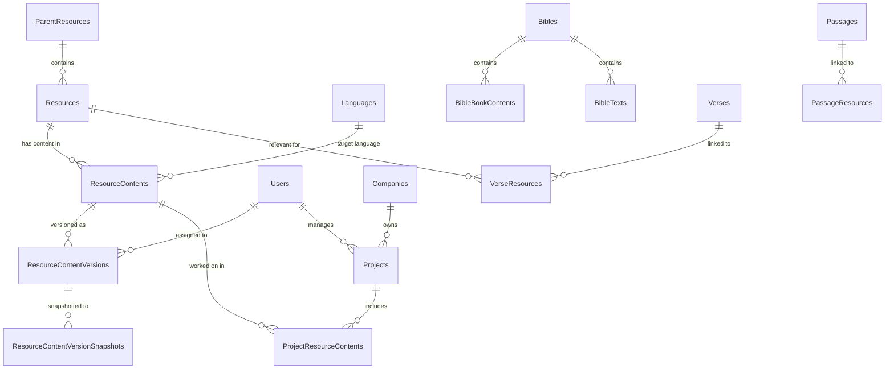

# Database

The Aquifer uses a single Azure SQL (MSSQL) database, accessed exclusively
through EF Core via `Aquifer.Data`. This document explains the **domain model
and conventions** so you can orient yourself quickly. It intentionally does not
enumerate every table and column — the entity classes
(`src/Aquifer.Data/Entities/`) and migrations (`src/Aquifer.Data/Migrations/`)
are the source of truth for that.

## Conventions

- **Table names are plural**, entity classes are singular with an `Entity`
  suffix (`ResourceContentEntity` → `ResourceContents`).
- **`Created`/`Updated` timestamps**: `Created` defaults to `getutcdate()` via
  the `[SqlDefaultValue]` attribute; `Updated` is maintained automatically by
  a `SavingChanges` event handler for entities implementing
  `IHasUpdatedTimestamp`. Set values in UTC; prefer letting the handlers do it.
- **Entity configuration** lives next to the entity in an
  `IEntityTypeConfiguration<T>` class wired up by the
  `[EntityTypeConfiguration]` attribute — not in `OnModelCreating`.
- **Indexes are explicit.** The `ForeignKeyIndexConvention` is removed, so EF
  will not create FK indexes automatically; add them deliberately on the
  entity. Filtered unique indexes enforce "only one draft/published version
  per content" rules.
- **JSON columns**: large structured payloads are stored as JSON strings
  (`ResourceContentVersions.Content` is Tiptap JSON — see
  [architecture.md](architecture.md#the-content-format);
  `BibleBookContents.AudioUrls` has a documented POCO on the entity).
- **Verse IDs are computed integers**, not auto-generated:
  `1_000_000_000 + (bookNumber * 1_000_000) + (chapter * 1_000) + verse`.
  `BibleUtilities` has helpers for the math; word-level identifiers extend
  this to `BBCCCVVVWWWS`. This encoding lets range queries find all verses in
  a chapter/book with simple integer bounds.

## Core content model

The heart of the schema. A **parent resource** (e.g. a translation guide or
dictionary) contains many **resources** (individual articles/entries), each of
which has **content** per language and media type, versioned over time.

### Resources and content

- **`ParentResources`** — The top-level "collection" a resource belongs to
  (e.g. a specific translation guide, dictionary, image set). Carries
  `ResourceType` (Guide / Dictionary / StudyNotes / Images / Videos),
  `ComplexityLevel`, license info, and whether it's enabled. Localized display
  names live in `ParentResourceLocalizations`.
- **`Resources`** — An individual entry within a parent resource (one article,
  one dictionary word). `EnglishLabel` is the canonical name; `ExternalId`
  links back to the source system it was loaded from.
- **`ResourceContents`** — One row per (resource, language, media type) —
  enforced by a unique index. This is the workflow hub: `Status` tracks the
  item through aquiferization/translation to `Complete` (see the lifecycle in
  [architecture.md](architecture.md#content-lifecycle-draft--published)).
  `LanguageId` is the target language, `SourceLanguageId` the language it was
  derived from.
- **`ResourceContentVersions`** — A version of the content. At any time a
  `ResourceContent` has at most one draft (`IsDraft`) and one published
  (`IsPublished`) version, enforced by filtered unique indexes and a check
  constraint (a version can't be both). `Content` holds the Tiptap JSON;
  `AssignedUserId`/`AssignedReviewerUserId` drive the editorial queues;
  `WordCount`/`SourceWordCount` feed project costing.
- **`ResourceContentVersionSnapshots`** — Immutable copies written at each
  status transition/publish. **This is what the public and well APIs serve**;
  the version tables are the working copy.

### Version metadata (history, comments, AI)

Hang off `ResourceContentVersions`:

- **`ResourceContentVersionStatusHistory` / `...AssignedUserHistory`** —
  Append-only audit trails of status transitions and assignments.
- **`ResourceContentVersionEditTimes`** — Per-user editing time, used for
  company billing/reporting.
- **`ResourceContentVersionCommentThreads`** → **`CommentThreads`** →
  **`Comments`** (+ **`CommentMentions`**) — Editorial commenting.
- **`ResourceContentVersionMachineTranslations`** — AI-generated draft content
  (HTML) with user ratings and retranslation feedback.
- **`ResourceContentVersionSimilarityScores`** — Similarity between source and
  translated content, computed by a background job; informs review effort.
- **`ResourceContentVersionFeedback`** — Feedback submitted on a version.

### Scripture linking

How resources get attached to the Bible:

- **`Verses`** — Every verse of the canon; the ID is the computed integer
  described above. No text lives here — this is the anchor table.
- **`Passages`** — Verse ranges (`StartVerseId`–`EndVerseId`, with a check
  constraint `Start <= End`).
- **`VerseResources` / `PassageResources`** — Many-to-many joins linking a
  resource to the verses/passages it discusses. These power "what resources
  exist for this passage?" queries.
- **`BookChapters` / `BookChapterResources` / `BookResources`** — Book- and
  chapter-level equivalents for resources that apply to whole chapters/books.
- **`AssociatedResources`** — Resource-to-resource "see also" links.
- **`VersificationMappings` / `VersificationExclusions`** — How verse
  numbering differs between Bible traditions; used to translate references
  across versifications.

### Bibles

- **`Bibles`** — A Bible version in a language (name, abbreviation, license,
  `RestrictedLicense`, `LanguageDefault`, `GreekAlignment` flag).
  `ContentIteration` bumps when content changes so clients know to re-sync.
- **`BibleBookContents`** — Per-book metadata: display name, chapter count,
  audio URLs (JSON, including per-verse timestamps), and content sizes for
  download estimates.
- **`BibleTexts`** — The actual verse text per (Bible, book, chapter, verse).
- **`BibleVersionWords` (+ `...WordGroups`, `...WordGroupWords`)** —
  Word-level tokenization of a Bible version, aligned to Greek data (word
  identifiers use the `BBCCCVVVWWWS` format).

### Greek / linguistic data

Reference data for original-language study, mostly loaded by content-loader:
`GreekNewTestaments`, `GreekWords`, `GreekLemmas`, `GreekSenses` (+
`GreekSenseGlosses`), `StrongNumbers`, `NewTestamentAlignments` (word-level
alignment between a Bible version and the Greek NT),
`GreekNewTestamentWord*` tables. **`TranslationPairs`** are UI-string
translations per language (not resource content).

### Projects and users (workflow management)

- **`Companies`** — Translation organizations; `CompanyLanguages` and
  `CompanyReviewers` define what they work on.
- **`Users`** — Internal users. `ProviderId` is the Auth0 subject;
  `Role` (Editor / Manager / Publisher / Admin / ReportViewer /
  CommunityReviewer / Reviewer) drives authorization in `Aquifer.API`.
- **`Projects`** — A unit of contracted translation work: source→target
  language, owning company, project manager, word counts, quoted cost,
  projected/actual dates. **`ProjectResourceContents`** is the join table of
  which resource contents are in scope. `ProjectPlatforms` is effectively a
  lookup (always Aquifer now).

### Engagement, notifications, and reporting

- **`ContentSubscribers`** (+ `...Languages`, `...ParentResources`) — People
  signed up for new-content digest emails (sent by an Aquifer.Jobs manager
  using **`EmailTemplates`**).
- **`Notifications`** — In-app notifications (e.g. assignment notices).
- **`ResourceContentRequests`** — Analytics: which content was requested via
  the APIs (tracked through a queue).
- **`Reports`** — Saved/dynamic report definitions for the admin CMS.
- **`Feedback`** — General user feedback submissions.
- **`Uploads`** — Tracks bulk upload operations.
- **`IpAddressData`** — Geolocation-ish metadata for request analytics.

### System / operational

- **`ApiKeys`** — Hashed API keys with a scope (`InternalApi`, `PublicApi`,
  `WellApi`); see [architecture.md](architecture.md#the-three-apis).
- **`JobHistory`** — Execution records for background job orchestrations.
- **`HelpDocuments`** — CMS help content.
- **`Languages`** — Language reference data (ISO codes, script, direction).

## Querying tips

- For anything user-facing, read from `ResourceContentVersionSnapshots`, not
  the version tables.
- Hot read paths go through `AquiferDbReadOnlyContext` (no change tracking,
  no event handlers).
- Some reporting endpoints use Dapper (`Aquifer.Data/DapperExtensions.cs`)
  for queries EF doesn't express well — follow that pattern rather than adding
  raw ADO.

## Migrations

Schema changes are EF Core migrations in this repo only. See
[development.md](development.md#database-migrations) for the workflow.

---
_Last verified: 2026-08-03_
