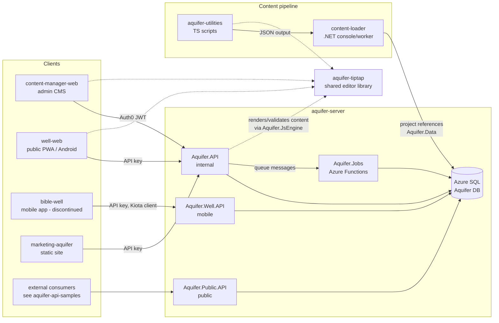

# Ecosystem Overview

This is the authoritative map of how the repositories in the `eten-tech` GitHub
organization relate to one another. Each repo's own documentation covers its
internals; this document only covers cross-repo relationships. When you learn
something here that has changed, update this file — every other repo links to it.

## The big picture

The Aquifer is a platform for creating, managing, and distributing biblical
translation resources (guides, dictionaries, study notes, images, videos) and
Bible texts in many languages. `aquifer-server` (this repo) is the hub: it owns
the database and exposes all APIs. Everything else is either a client of those
APIs, a tool for getting content into the database, or a shared library.

## Repository directory

### Serving and storing content

**aquifer-server** (this repo) — Three ASP.NET Core APIs plus background jobs,
sharing one EF Core data layer over Azure SQL. See [architecture.md](architecture.md)
and [database.md](database.md).

### Consuming content

**content-manager-web** — SvelteKit admin CMS. Where internal users and
translation companies create, edit, review, and manage resource content,
projects, and users. Calls `Aquifer.API` with Auth0 JWTs.

**well-web** — SvelteKit PWA (and Capacitor Android app) for end users to read
Aquifer content, with an offline-first service-worker caching model. Calls
`Aquifer.API` with an API key.

**bible-well** — ⚠️ **Discontinued.** An early cross-platform mobile app
experiment (Avalonia UI + MAUI Essentials) that called `Aquifer.Well.API`
through a Kiota-generated C# client. No new development is planned; the repo
remains for reference only. `Aquifer.Well.API` still exists in this repo and
its client-generation flow targets this repo's sibling clone convention, but
treat the mobile app itself as archived.

**marketing-aquifer** — Framework-less static marketing site for the Aquifer,
including a public resource-availability tracker that calls `Aquifer.API`
directly from the browser with an API key.

**aquifer-api-samples** — Example projects (C#, React) showing external
consumers how to use `Aquifer.Public.API`. Also hosts the most complete
documentation of the resource content (Tiptap/ProseMirror JSON) schema in its
`documentation/` folder — read it before hand-rolling content JSON.

### Getting content into the database

**content-loader** — .NET console apps and worker services for bulk-loading and
transforming content in the Aquifer DB. **Project-references `Aquifer.Data`,
`Aquifer.Common`, `Aquifer.JsEngine`, and `Aquifer.Tiptap`, so it must be
cloned as a sibling directory of this repo.** Long-running loads are deployed
to Azure Container Instances via Azure Container Registry.

**aquifer-utilities** — TypeScript (Bun) scripts and a small pipeline framework
for scraping, downloading, and normalizing external content sources (e.g. FIA,
Open Bible). Produces JSON that is then loaded by `content-loader`. Expects
`content-loader` as a sibling directory.

### Shared libraries and tooling

**aquifer-tiptap** — Custom Tiptap rich-text editor extensions (Bible
references, videos, comments, footnotes) plus HTML/JSON parsing helpers. This
is the shared definition of Aquifer's content format, consumed by:
- `content-manager-web` and `well-web` (rendering/editing in the browser),
- `aquifer-server` (server-side rendering/validation in .NET via
  `Aquifer.JsEngine`, which executes the package's JS),
- `aquifer-utilities` (building content JSON).

Distributed via GitHub releases (not npm), referenced as a GitHub dependency.

**github-action-slack-notify-build** — Forked GitHub Action that posts
deployment/build status to Slack (with Linear ticket enrichment). Used by the
deploy workflows of `aquifer-server`, `content-manager-web`, and `well-web`.

## Working across repos

Some tasks span multiple repos; clone these as sibling directories:

| Task | Siblings required |
|---|---|
| Run or build `content-loader` | `aquifer-server` |
| Regenerate the bible-well API client | `aquifer-server`, `bible-well` |
| Run `aquifer-utilities` pipelines | `content-loader` (and transitively `aquifer-server`) |
| Change content JSON structure | `aquifer-tiptap` + all consumers above |

Schema changes to the Aquifer DB always happen in this repo via EF Core
migrations (see [development.md](development.md#database-migrations)); other
repos never migrate the database themselves.

## Deployed environments

| API | Production | QA |
|---|---|---|
| Aquifer.API (internal) | `https://api-bn.aquifer.bible/` | `https://qa.api-bn.aquifer.bible/` |
| Aquifer.Well.API | `https://api-well.aquifer.bible/` | `https://qa.api-well.aquifer.bible/` |
| Aquifer.Public.API | `https://api.aquifer.bible/` | — |

Front-ends are Azure Static Web Apps; APIs are Azure Web Apps; jobs are Azure
Functions; see [infrastructure.md](infrastructure.md) for the Azure specifics.

---
_Last verified: 2026-08-03_
